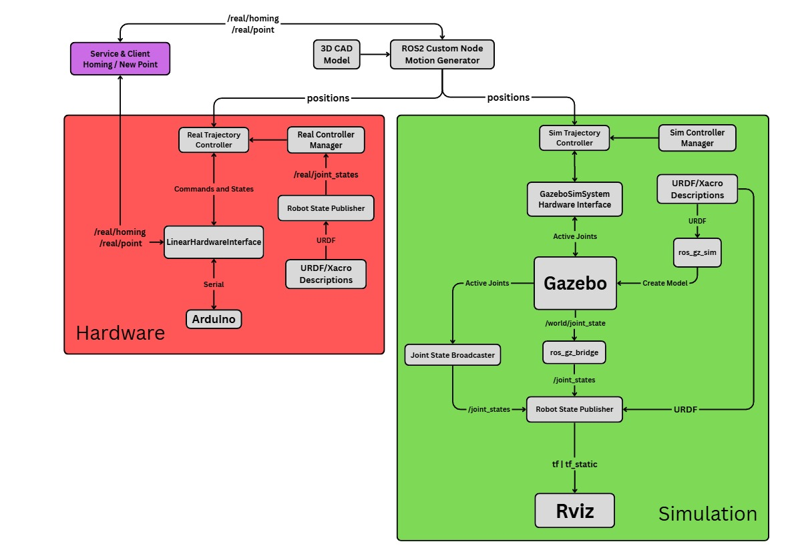
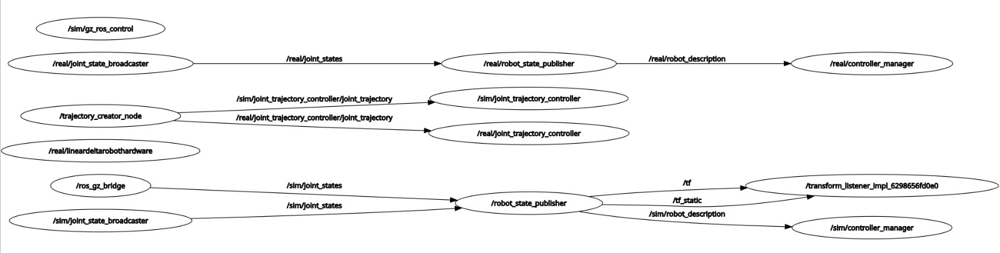
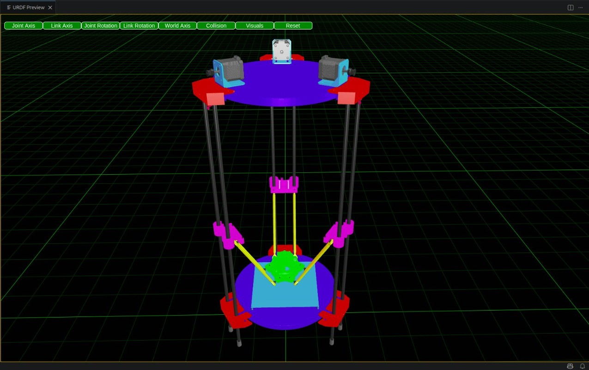
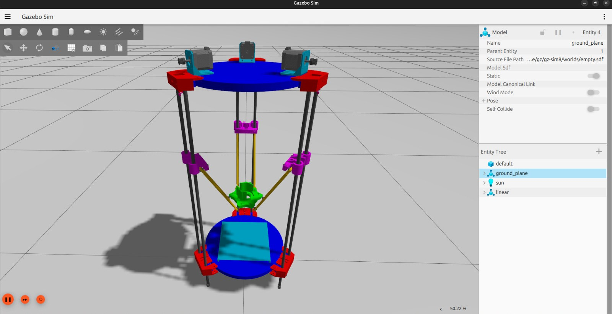
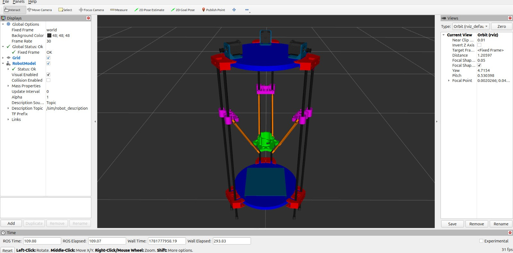

# Linear-Delta-Robot

This is the overall sequence of ROS2 processes (topics, nodes, services) on Simulation and Hardware side

ROS2 rqt shows all the nodes and topics

URDF/Xacro preview

Gazebo overview

Rviz overview

